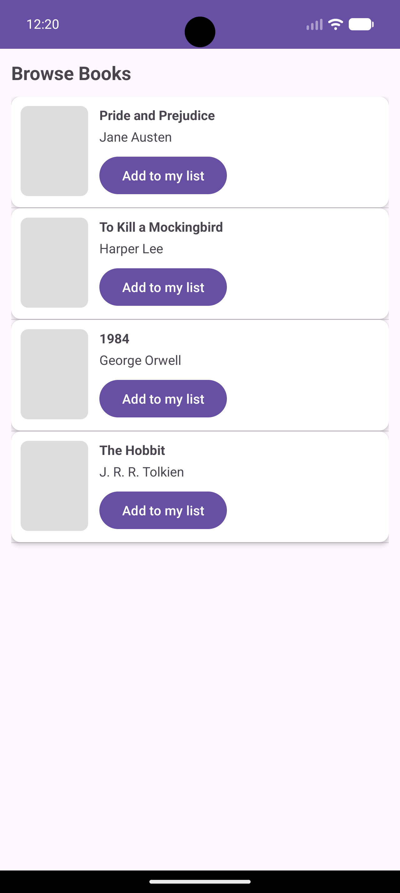
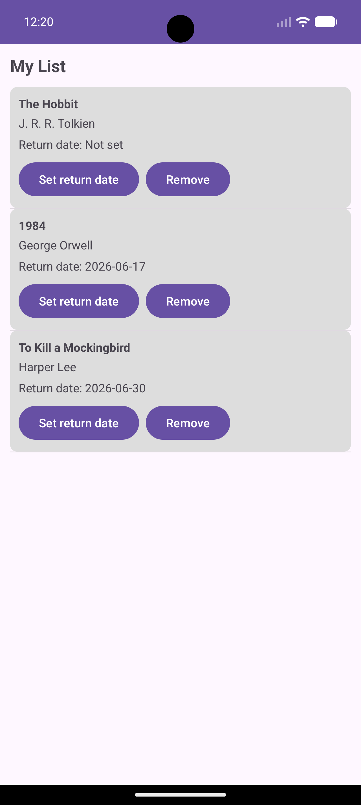

# bookworm-android-firebase

Java Android school project that demonstrates a small book library app with Firebase.

## Features

- `MainActivity` with logo and navigation buttons
- `BrowseBooksActivity` list with add-to-my-list action
- `MyListActivity` list with return date picker and remove action
- `AuthActivity` for email/password register, login, and logout
- Firebase integration:
  - Authentication
  - Cloud Firestore
  - Storage-ready image URL field

## Stack

- Java 17
- Android SDK 34
- AndroidX + Material + ConstraintLayout + CardView
- Firebase Auth + Firestore + Storage
- Glide for image loading

## Project structure

- `app/src/main/java/com/bookworm/firebaseapp/activities`
- `app/src/main/java/com/bookworm/firebaseapp/adapters`
- `app/src/main/java/com/bookworm/firebaseapp/models`
- `app/src/main/java/com/bookworm/firebaseapp/data`
- `app/src/main/res/layout`

## Screenshots

- 
- 
- 
- 


## Quick try

```zsh
JAVA_HOME="/Applications/Android Studio.app/Contents/jbr/Contents/Home" ./gradlew test
JAVA_HOME="/Applications/Android Studio.app/Contents/jbr/Contents/Home" ./gradlew assembleDebug
```

If Gradle wrapper is missing in your local copy, open the project in Android Studio and run the Gradle sync/build from the IDE.

## Notes

- This repo is intentionally simple for school grading, not production.
- `BrowseBooksActivity` seeds a few sample books in Firestore when `books` collection is empty.
- Firebase rule deploy config is included in `firebase.json` and `storage.rules`.
